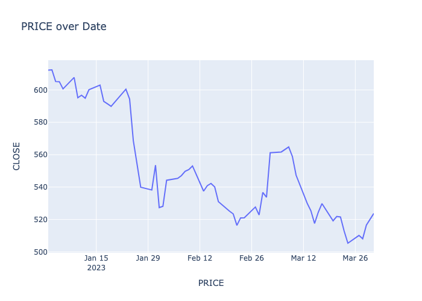
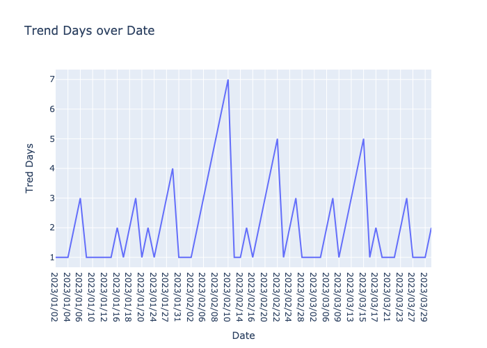
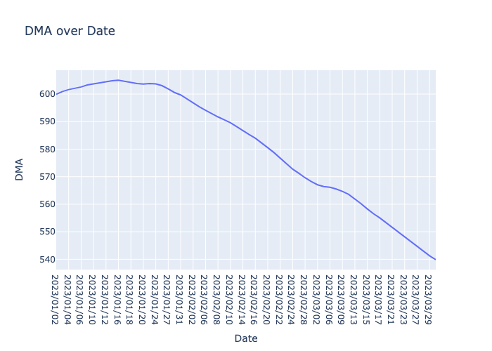
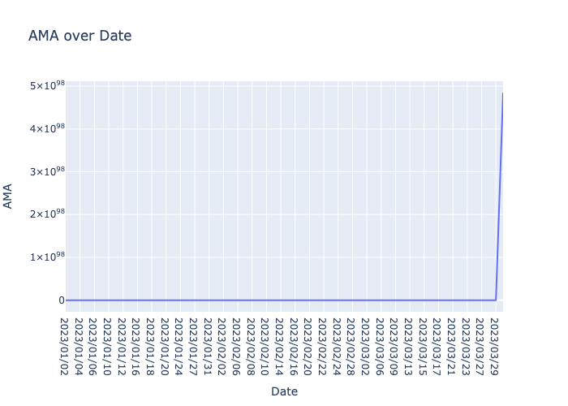
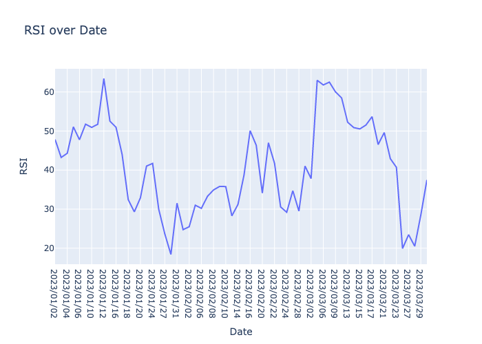
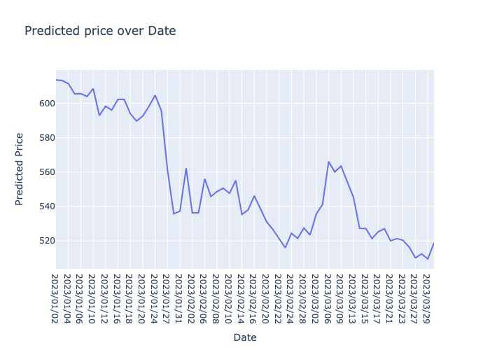
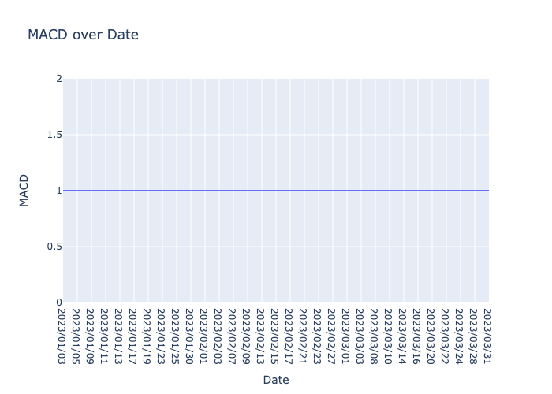
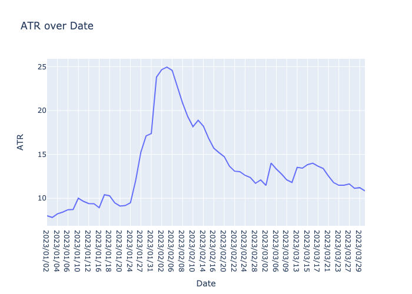

# COP290: Design Practices - Trading Simulator and Analyzer
Hemanshu Garg 2022CS11090 

Sahil Kumar 2022CS11100
## Installation

Install requirments.txt 

```bash
    pip install -r requirements.txt
```

Use the following commands to simulate the strategies on the given parameters.(date should be in DD/MM/YY format) 
```bash
    make strategy=BASIC symbol=SBIN n=5 x=2 start_date="b" end_date="a"
    make strategy=DMA symbol=SBIN n=50 x=3 p=2 start_date="a" end_date="b"
    make strategy="DMA++" symbol=SBIN x=4 p=5 n=14 max_hold_days=28 c1=0.2 c2=2 start_date="a" end_date="b"
    make strategy=MACD symbol=SBIN x=3 start_date="a" end_date="b"
    make strategy=RSI symbol=SBIN x=3 n=14 oversold_threshold=30 overbought_threshold=70 start_date="a" end_date="b"
    make strategy=ADX symbol=SBIN x=3 n=14 adx_threshold=25 start_date="a" end_date="b"
    make strategy="LINEAR_REGRESSION" symbol=SBIN x=3 p=2 train_start_date="a" train_end_date="b" start_date="c" end_date="d"
    make strategy="BEST_OF_ALL" symbol=SBIN start_date="a" end_date="b"
    make strategy=PAIRS symbol1=SBIN symbol2=ADANIENT x=5 n=20 threshold=2 start_date="a" end_date="b"
    make strategy=PAIRS symbol1=SBIN symbol2=ADANIENT x=5 n=20 threshold=2 stop_loss_threshold=4 start_date="a" end_date="b"
```

## Abstract 
In the following report we discuss about our implentations of various strategies and what design/abstraction decisions we took while writing of our code. We then also discuss briefly about the strategies themselves and our takeways from analysising them.  


## Introduction
Focusing on the design and implementation of a Trading Simulator and Analyzer. The goal is to explore various algorithmic trading strategies, implement them in C++, and analyze their performance using historical data. below are the strategies we have implemented 

### Strategies Implemented
1. **Momentum-Based Strategies**: Observes price series patterns over the past `n` days to make trading decisions.
2. **Trend-Based Strategy (n-Day Moving Average - DMA)**: Uses the mean price of the past `n` days and standard deviation to decide on trades.
3. **Improving DMA**: Incorporates stop-loss and an adaptive Moving Average (AMA) into the DMA strategy.
4. **MACD (Moving Average Convergence Divergence)**: Implements the MACD indicator for trend analysis.
5. **RSI (Relative Strength Index)**: Utilizes the RSI indicator to identify overbought or oversold conditions.
6. **ADX (Average Directional Index)**: Applies the ADX indicator to measure the strength of a trend.
7. **Linear Regression**: Predicts stock prices using linear regression and makes trading decisions based on the prediction accuracy.
8. **Best of all**:  It demonstrates the use of OpenMP for parallel execution in the `BEST_OF_ALL` strategy, which concurrently runs multiple strategies to determine the most profitable one.
8. **Pairs Trading Strategy**: Focuses on the price spread between a pair of correlated stocks.
9. **Stop-Loss in Pairs Trading Strategy**: Implements a loss-based stop-loss strategy in pairs trading.

### Project Structure
The project directory is structured as follows:

- `include/`: May contain the additional header files for the C++ source code. 
- `resources/`: The data for the strategies to work upon are made availiable in the resources. 
- `src/`: The source code for the trading strategies implemented in the project.
  - `adx.cpp/h`: Implementation of the Average Directional Index (ADX) strategy.
  - `basic.cpp/h`: Code for the basic momentum trading strategy.
  - `bestofall.cpp/h`: Combines various strategies to determine the best performing one.
  - `DMA.cpp/h`: Code for the n-Day Moving Average strategy.
  - `DMA++.cpp/h`: Improves upon the DMA strategy by incorporating additional features.
  - `linear_regression.cpp/h`: Implementation of the Linear Regression strategy for price prediction.
  - `macd.cpp/h`: Moving Average Convergence Divergence (MACD) indicator-based strategy.
  - `rsi.cpp/h`: Relative Strength Index (RSI) indicator-based strategy.
  - `simple_pairs.cpp/h`: Pairs trading strategy based on the correlation between two stocks.
  - `stock_data.cpp/h`: Utilities to manage and process stock data.
  - `stop_loss_pairs.cpp/h`: Implementation of the stop-loss feature in the pairs trading strategy.

- `data_gen.py`: A Python script for generating historical data required for backtesting the strategies.
- `main.cpp`: The entry point of the application, tying together all the strategies.
- `Makefile`: Script for running the strategies. 
- `README.md`: This markdown file report of the project.
- `requirements.txt`: Lists all the Python dependencies required for the project.

## Design and Abstractions

The project is designed with a clear separation of concerns, dividing the process into data handling, strategy implementation, execution, and output generation. There is an attempt to follow some common standards for the code like not using namespace std, DRY, etc. We are also compiling the final version with `-O3` flag for faster executables.

### Data Handling
The `stock_data.h` file has a `StockData` struct, which is a container for all stock-related data (e.g., open, high, low, close prices, etc.). The data is read from a CSV file into a `std::vector<StockData>`,The `Input`struct contains all the possible parameters which the stragies will need and the `Output` class is the common data type to which all strategies return to (the class has methods to write the required output files). These become the primary data structure used throughout the strategies. This allows very high modularity in utilizing the stragies for example now to run a strategy simply `<strategy>(data,input)` needs to be called and the return type is same.

Functions for date manipulation such as `reverse`, `replace_hyphens`, and `revback` are used to format the date strings accordingly, ensuring consistency in date representations throughout the program.


Each trading strategy is encapsulated in its own pair of source and header files (`.cpp` and `.h`), promoting modularity and ease of maintenance. 


Each strategy file contains the function `<strategy>(data,input)` that takes stock data and relevant parameters as input and outputs trading decisions. Data is of type `std::vector<StockData>` and input is of `Input` type.

### Execution Flow
The parameters provided by the command line are used by the `data_gen.py` to generate one or two `.csv` that is then digested by `main.cpp` into a `std::vector<StockData>` that is used by the strategies.
The `main.cpp` file orchestrates the execution of the selected trading strategy.The output files are written by calling their `.write(<true/false>)` method. 

Some points worth mentioning : 

**Output Generation**
The `Output` class is responsible for writing the results of the trading strategies to the filesystem. The `write` function in the `Output` class checks the `is_pair` flag to determine the correct output format, which suggests a design with attention to the different requirements of single stock strategies versus pairs trading strategies.

 **Error Handling**
The data reading function `readStockPrice` includes basic error handling to check if the file is open, demonstrating the robustness of the design in terms of input validation.

### Algorithmic Optemizations 

**DMA/DMA++/BASIC/PAIRS** : Used sliding window to make these run in `O(n)` where n is corresponds to number of trading days. 

**STOP_LOSS_PAIR** : We need to close multiple position on same day based on z-score and stoploss threshold so we are able to achieve and maintain this is in theta of the current number of open positions.   


**Linear Regression** : The biggest optimizations have been done for this. A very big concern in directly using the normal form and calculating inverse is that methods of calculation inverse is computationally heavy and numerically unstable(accumulation of floating point error). Hence we explored and concluded to use one of the standard algorithms of `QR factorisation and Modified Gram Schmidt`(which is numerically much stable). 
The book reference : `Numerical Linear Algebra (Lloyd N. Trefethen, David Bau III)`. 
This also allowed us to solve for the weights of the model in `$O(mn^2)$` order where m is the number of  training days and n is the number of features. The function to calculate the `R score` also has been written. 


## Observations and Trends on various strategies 

Below are the graphs of the price of stock/ various indicators / predicted prices/ for the nifty50 stock with symbol `SBIN`  : 

**Trading Period**  : 01/01/2023 to 31/03/2023 

**Training Period of LR** : 01/01/2022 to 31/12/2023  and p =2 

For basic, we use n=7. For DMA, n=50. For DMA++, RSI and ADX,
n=14.
• Maximum position in all cases will be restricted to x=5.
• adx threshold=25, oversold threshold=30, overbought threshold=70, max hold days=28,
c1=0.2, c2=2.
• For DMA, p=2, while for DMA++, p=5. 
The R score of the Linear regression is 0.977409 

### SBIN : 
  

### BASIC: 
  

### DMA:
  

### DMA++:
  

### RSI: 
  

### linear_regression: 
  

### MACD: 
  

### ADX:
  


